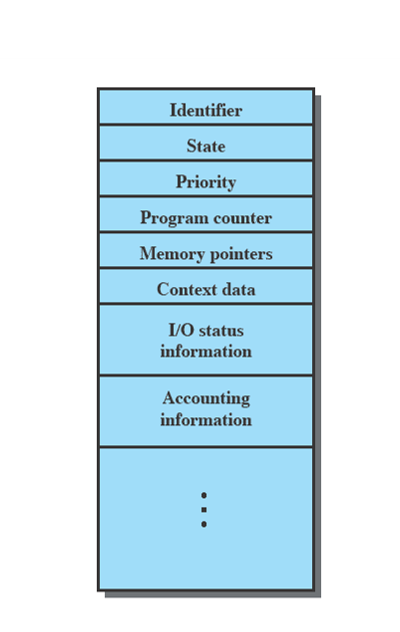
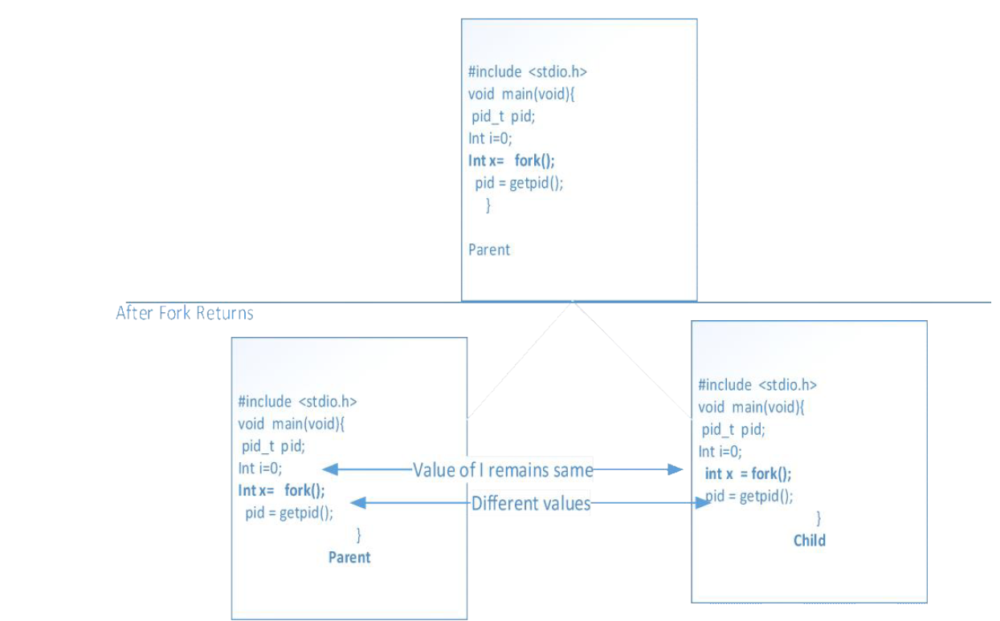

# Creation of a process -- the isolation between user space and kernel space

- A process is created when we **execute** a program. A program is a list of instructions compiled together to implement an algorithm or do some computation that we want to perform. Typicall, this program is launched via a shell.
- system calls are the interfaces provided by the operating system. These interfaces can be used to request the services of the operating system.
- A *system call* is a controlled entry point into the OS kernel, allowing a process to request that the kernel perform some action on the process's behalf.
- There is strict isolation between **processes** and the **kernel**. This is required to ensure safety and correctness of the computing system.
- The core concept behind this isolation is the **user space** and **kernel space** concept.
- This is supported by a special register in the processor. For example, the register CPL - if current privilege level is set to 0, the processor assumes that the kernel space tasks are being run. If CPL is 3 then user space tasks i.e. regular processes are running.
- The system calls are implemented in a way that this mode switch happens automatically when the system call is invoked. This is required because  when the user space process requests the operating system service via the system call, the control has to be switched to the kernel space task and then back to the user space.
- The  instruction on x86 that does is *int 0x80*.
- The system call invocation macro (implemented in the C library) executes a trap machine instruction. This is *int 0x80*. This causes the processor to switch from user mode to kernel mode (that is, it sets CPL=0) and executes the code pointed to by location *0x80* of the system's trap vector.
- The kernel invokes its *system_call* routine to handle the trap to location *0x80*. This is where the meat of the system call logic happens: the kernel does some bookkeeping, checks the validity of the arguments, invokes the service routine, and finally the service routine returns a result status to the *system_call* routine.
-  The wrapper function checks if the service returned an error, and if so, sets a global variable named *errno* with this error value. The wrapper function then returns to the caller and provides an integer return value to indicate success or failure.

# Understanding Processes

- Recall that process is a unit of execution. It is created when a program is executed. Multiple instance of same programs can be running simultaneously. Each instace is identified by using PID. Recall that you can use some of the current process in your linux installation using the ``top`` command.

## Anatomy of a process. 


- The different sections of a processes' memory layout are:
   - Text Segement (lowest memory address). This contains the binary image or the instructions that are being executed.
   - Data segement. This contains all the global static variables that have been initialized, e.g. 
   
   ```
    #include <stdio.h>
	static char* message="Hello world"; //stored in data segement
	int main ()
	{
	  static int data=2; //stored in data segement 
	  printf("%s\n",message);
	}
   ```
   - BSS Segement (Block Started by Symbol) holds the uninitialized global variables. This segment was used to store global uninitialized variables in assembly code.
   - BSS also stores the uninitialized static local variables.
   ```
    #include <stdio.h>
	static char* message; //stored in BSS;
	int main ()
	{
	  static int data; //stored in BSS
	  printf("%s\n",message);
	}
   ```
   - HEAP : it is used for dynamic memory allocation. The process can request increase and decrease in the size of heap from the kernel. Some times a random offset between BSS and Heap is introduced so that a malicious code cannot guess the actual start address of heap.
     - HEAP is said to grow upwards (toward higher memory addresses).
   - Memory mapping segement : This is where all the dynamic libraries are loaded.
   - Stack:  The stack is a last in first out structure used to store automatic variables. It is also used to manage the control flow between subroutines. A special register called **stack pointer** holds the address of the top of the stack. This is adjusted when something new pushed on to the stack.
      - Note that stack grows down. That is it frows toward the 0 memory location. 
      - Stack is also used to track the return address for returning from the function.
      - Stack is also used to transfer function parameters during a function call.
   - You can use the ``size'' shell command on your executable to find out the size of each of these segments.
   - Top 1 GB of space of each process is reserved to hold the data for the kernel. This is done for efficiency. When a process makes a system call, the system call wrapper just points to a virtual address within the processes's address space. 
      - A process cannot alter the contents of the top 1 GB. This is prevented by the CPL register we discussed earlier.
   
   
   
# Direct Execution of program (Microcontroller)

- Load first instruction to program counter (PC)
- Execute
- Repeat (Loads next instruction into PC)
- What are the problems with direct execution:
- What if process wants to do something restricted ? 
- What if you have more than one process.

# The goal of the operating system is 	to run several processes concurrently.

- Each process thinks that it is the only one running on its own isolated machine (illusion)
- The CPU is time shared between the processes. In other words, the CPU resource is virtually shared .


# Running concurrent processes - limited direct execution 
- High level algorithm: Repeated at a high rate (linux typically runs this @250 Hz. This value is configurable. The parameter is called ``CONFIG_HZ``)
	- Load process
	- Run instruction
	- Save State <-- Important. Think why?
	-  Decide what to switch to (also called **context switch** - i.e. switch the context from one process to the other.) <-- Done by the kernel using the sceduler mechanism. We will discuss it later in the semester.
	-  Go to Load another process
		
		
# So what constitute the state of a process.
- Register : the current contents of the register. They have to archived if the process is going to resume execution from where it left.
- Program Counter: It points to the current instruction that is being run.
- Stack pointer: This is a special register that points to the top of the stack used by the process. Recall stack is used for controlling the order of the function execution as well as knowing where to return when a subroutine is called.
- Open File Descriptors
  - In Unix and related computer operating systems, a file descriptor (FD, less frequently fildes) is an abstract indicator (handle) used to access a file or other input/output resource, such as a pipe or network socket.
  - Examples, from UNIX / Linux:
  
```
fd = open("out", 1);
write(fd, "hello\n", 6); /* fd is the file descriptor */
```
  -  There are three default file descriptors for each process - STDIN, STDOUT, and STDERR
  - Refer to http://man7.org/linux/man-pages/man3/stdout.3.html
- The current execution state of the process <-- important.

# The OS stores this state in a data structure (one per process). This data structure is called process control block. In Linux this data structure is named **task_struct**



		
# Switching between processes (context switch)
- What if the running process starts a slow procedure like interrupt?
- In principle there are two different kinds of techniques for deciding when to context switch.
	- co-operative: wait for the process to yield or issue syscall
	-  Non-cooperative – set a periodic timer. When the timer interrupt comes, do not go back to the process that was executing before the interrupt arrives, but load another process. Also if the process makes a system call, the kernel can switch to another process when it finishes the execution of the service call.
-  General algorithm of context switch
	- It is implemented by the operating system scheduler. The scheduler maintains several queues. Each queue corresponds to one of the execution states a process can be in.
	- One of these queues is the ready queue. 
	- Let us assume that we only have one CPU. Then, one of the processes will be in the **runnning** state.
	- To context switch, the scheduler will change the state of the currently running process, put it into a different queue. Then, pick a different process (based on a scheduling policy - we will cover it later) and mark it running.
	

# Process Execution State

-  Ready, Running and BLOCKED
-  A process is marked waiting if it needs to interact with a peripheral, which is generally slower compared to the CPU.
-  When the peripheral sends an interrupt indicating that it is done, the OS can move the process from the waiting queue to the READY queue.
-  Then the OS can decide to run it at the next time there is a context switch.
	

## How is a process created

- To create a process all data structures have to be setup
- A shortcut available to the OS is to copy the data structure from an existing process and then change as needed.
- When combined with the concept of *copy on write* this can be very efficient
  - Copy on write implies the net memory required to store the two data structures will not be double/ but will depend on the number of changes.
- This is done by the `fork` system call.
  - Review the fork man page
  - During fork, all the contents of the parent address space are copied over to the child. Any open file in parent will also be open in child.   
  - All processes in a Unix machine are related to each other. The operating system creates a process called init during the system start up sequence. The pid of that process is 1. The second process is created by cloning the init process and so on.
  - You can see the process relationships by using the command pstree.

- A simple fork example.

```

#include <stdio.h>
void main(void)
{ 
  pid_t pid; 
  int x= fork(); 
  pid = getpid(); 
}

```  

- [Another fork example](https://github.com/CS3281/examples/tree/master/processManagement/basicfork)

*Note* -- the process is in the execution state immediately after creation.

*Another Note* - The fork returns a positive number (pid of the child in the parent) and returns 0 in the child address space. That is how you can write the following piece of code.

```
#include <stdio.h>
void main(void){
  pid_t pid; 
  int x= fork();
  If(x==0){
  //This is a child process
  }
  else if (x>0){
  //This is the parent process
  }
  else{
  //error occured
  } 
  pid = getpid(); 
}
```


## Loading in a new program

- Okay so if all processes are cloned, how do we change the program? This is done by the exec system call. Exec system tells the kernel to load a new program into the current address space (the address space of the program calling exec.) 

### Review 

-	Command line arguments are positional parameters passed to a program. e.g. ``ls –l`` or ``cd  /opt``
-	In most OSes , the first positional argument tells the name of the program and is identified by the 0th argument
-	Read http://crasseux.com/books/ctutorial/argc-and-argv.html

## Back to exec 

-   example


```
#include <stdio.h>
#include <unistd.h>

int
main(int argc, char *argv[])
{
  int pid;

  pid = fork();

  if (pid == 0) {
    execl("/usr/bin/sort", "sort", "-n" , "input.txt", (char*) NULL);
  }
}
```

- other variants
  - int execl(const char *path, const char *arg, ...);
    - e.g. execl("/usr/bin/sort", "sort", "-n", "input.txt", (char*) NULL);
  -	int execlp(const char *file, const char *arg, ...);
    - execlp("sort", "sort", "-n", "input.txt", (char*) NULL);
  -	int execle(const char *path, const char *arg, ..., char * const envp[]);
    -	Pass the environment variables as an array as well.
  -	int execv(const char *path, char *const argv[]);
  -	int execvp(const char *file, char *const argv[]);
    - [example](https://github.com/CS3281/examples/tree/master/processManagement/execvpexample)
  -	int execvpe(const char *file, char *const argv[], char *const envp[]);

-   Termination - Release resources and clean up data structures.


## So how does the program terminate

-	Finishes executions (returns from main)
-	Decides to terminate itself (calls a function called exit -look at man page)
-	Someone decides to terminate the process. By sending it a signal.
-	We will review signals later. They are software interrupts that one process (or the OS) can send to another process. It always interrupts the target process, causing it to either handle the signal or terminate.
- 	Note that not all signals can be handled. Also a program has to explicitly specify that it wants to handle a signal and has to provide a signal handler function.  http://linux.die.net/man/2/signal


	

	

 
	

	

	
