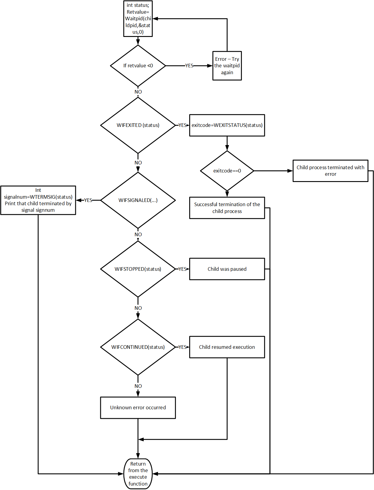

# Process termination

A process can terminate in one of two general ways: *normally* or *abnormally*. Normal termination includes things like returning from *main* or calling *exit*. Abnormal termination is caused by things like receipt of a *signal* or calling the *abort* function. 

# Signals

*Signals* are a technique used to notify a process that some condition has occurred. They are also sometimes called *software interrupts*. For example, if a process divides by zero, the signal whose name is SIGFPE (floating-point exception) is sent to the process. The process has three choices for dealing with the signal.

 1. Ignore the signal.
 2. Let the default action occur. The default action for most signals is to terminate the process.
 3. Catch the signal. We do this by telling the kernel to call a function of ours whenever the signal occurs. The way we tell the kernel to call our function is with the *signal* function, which we will describe below.

So what can generate a signal? Lots of things.

 * Terminal-generated signals occur when you press things like Control-C, which causes the interrupt signal (SIGINT) to be generated.
 * Hardware exceptions, such as dividing by 0 or referencing invalid memory, generate signals.
 * The *kill* function allows processes to send signals to other processes.

The transfer of a signal to a destination process occurs in two distinct steps:

 1. Sending a signal. The kernel delivers a signal to a destination process by updating some state in the context of the destination process. The signal is delivered for one of two reasons: (1) the kernel detected a system event (such as divide by zero), or (2) a process invoked the *kill* function to send a signal to the destination process.
 2. Receiving a signal. The destination process *receives* a signal when it is forced by the kernel to react in some way to the delivery of the signal. This *reaction* is one of the three choices described above (ignore, handle, or let default action occur).

# Registering a signal handler

Let's suppose we want to catch a signal. How do we tell the kernel which function to call when the signal occurs? Using the *signal* function, whose prototype is the following:

```c
void (*signal(int signo, void (*func)(int)))(int);
```

This declaration says the following. signal is a function that takes two arguments: an int (signo), and a pointer to a function that takes an int and returns void. signal returns a pointer to a function that takes an int and returns void.

The value of *signo* is the name of a signal. 

The value of *func* can be one of three things:

 1. The constant SIG_IGN, which means "ignore this signal". Two signals cannot be ignored: SIGKILL (kill the process) and SIGSTOP (stop the process).
 2. The constant SIG_DFL, which means "take the default action".
 3. The address of a function to call.

# Core dumps

The default action for some signals, like SIGABRT (abnormal termination) or SIGSEGV (invalid memory reference), is to terminate the process and generate a *core dump*. A *core dump* file contains an image of the virtual memory of the process, which can be loaded into a debugger in order to inspect the state of the process at the time that it terminated.

# Back to process termination

When a process terminates in Linux, the kernel releases the resources the process owned and tells the parent by sending the SIGCHLD signal to the parent. The kernel keeps a few of the process related structures around (like its *task_struct*), but most of the resources are released. After the parent either (1) obtains information on the terminated child, or (2) informed the kernel that it doesn't care, only then does the kernel de-allocate the remaining task-related descriptors, like the *task_struct*.

A parent process can find out when and how a child process terminates using the *wait()* system call:

```c
pid_t wait(int *status);
```

This function causes the parent to wait for one of its children to terminate and returns the termination status of that child in the buffer pointed to by status. If the child hasn't terminated yet, then this call will *block*. The *pid* of the child that terminated is the return value of *wait*.

In order for the parent process to determine the specific reason that a child terminated, it must inspect the value of *status*. This is done using four different macros that all being with "WIF". Based on which of these macros is true, other macros are used to obtain additional information, like the exit status and/or signal number. The four macros are:

 1. *WIFEXITED(status)* - this returns true if the process terminated normally. In this case, you can use the *WEXITSTATUS(status)* macro to obtain the return value. Note that terminating *normally* and terminating *successfully* are two different things.
 2. *WIFSIGNALED(status)* - this returns true if the propcess terminated *abnormally* because of a signal it didn't catch. In this case, we can execute
*WTERMSIG(status)* to fetch the signal number that caused the termination.
 3. *WIFSTOPPED(status)* - this returns true if status was returned for a child that is currently stopped. In this case, we can execute WSTOPSIG(status) to fetch the signal number that caused the child to stop.
 4. *WIFCONTINUED(status)* - this returns true if status was returned for a child that has been continued after a job control stop.

You should review the wait example here:
 * [https://github.com/CS3281/examples/processManagement/basicwait/basicwait.c](https://github.com/cs3281/examples/tree/main/processManagement/basicwait)


* Question - how can you know what instruction was executing in the program when a program fault occured that resulted in a signal that terminated that process?
	* If enabled, the kernel generates a ``core file`` for the offending process. 
	*  A core file or core dump is a file that records the memory image of a running process and its process status (register values etc.). Its primary use is post-mortem debugging of a program that
	crashed while it ran outside a debugger.
	* Example core dump usage: https://www.youtube.com/watch?v=mlfz6c9frSU

 ## Understanding the complete wait process

  

# Examples

- [memoryerror.c](https://github.com/cs3281/examples/blob/main/processManagement/managingChildProcess/memoryerror.c) - we intentionally generate a SIGSEGV by trying to dereference a null pointer. We catch that signal, but then the question to the students is: why does our signal handler keep repeatedly getting called? The answer is that because it was a machine instruction in our own program that generated the error and thus the signal, when the signal handler returns, it keeps going back to that same instruction. The instruction repeats, we get a SIGSEGV again, and we never get out of that endless loop.
- [notifychild.c](https://github.com/cs3281/examples/blob/main/processManagement/managingChildProcess/notifychild.c) - we set up a signal handler to catch the SIGCHLD that tells us when a child process terminates. In the parent, we then ask to wait for 20 seconds, but we complete our execution almost immediately. Why doesn’t the parent sleep for 20 seconds? The answer is that the call to sleep was interrupted by a signal handler. If we were to check the return value of sleep, we would see that we have a lot of time left.

There are other examples that you should review.

- https://github.com/CS3281/examples/tree/master/processManagement
- These examples provide a review of the following calls.

  - fork
  - execlp
  - waitpid
  - execv
  - signal
  - SIGCHLD - it is a signal whose default action is ignore. If a handled is registered then, the parent can know when a child has terminated

- zombie processes : On Unix and Unix-like computer operating systems, a zombie process or defunct process is a process that has completed execution (via the exit system call) but still has an entry in the process table: it is a process in the "Terminated state".  It exists because parents can obtain information about them.  Therefore, it is necessary for the parent to use the wait/waitpid call to obtain the status.
	
- What happens if the parent dies? In that case, the child is attached to the init process - who cleans up after the process termination.
	
- Review of concurrency
 - At a time multiple processes can be executing on the system.
 - Recall the discussion about context switching 

 
