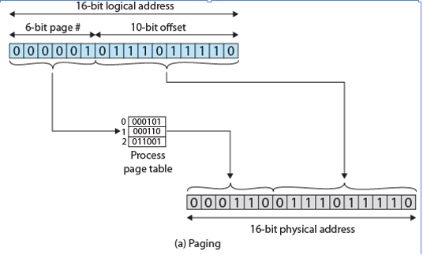
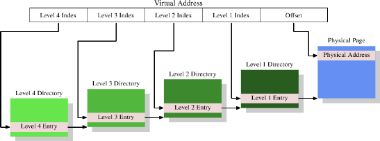
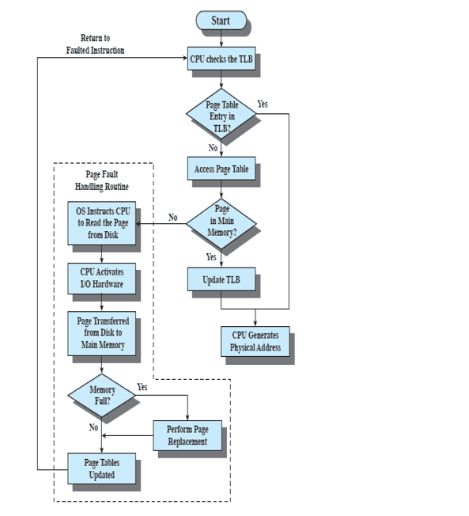
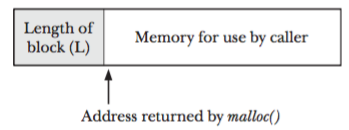
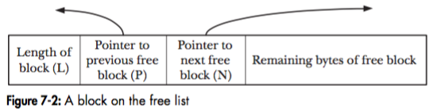
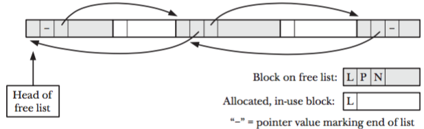

# Overview

We've already seen that modern operating systems, like Linux, provide each process with their own private address space.

## Early systems

In very early systems, only one program was loaded into memory at a time. Pretty simple.

But, what happens if you want to be able to switch to another process when one does something that requires blocking (like I/O)? Multiple processes have to be put in memory. Thus, the OS needs to be able to store the memory for multiple processes in a single physical memory.

An OS provides the concept of an *address space* that virtualizes the physical memory into a virtual memory.

The goals are straightforward:

 1. Transparency
 2. Efficiency
 3. Provide protection

# Address translation

The basic problem is how to virtualize memory efficiently. The generic technique is (hardware-based) address translation: the hardware efficiently transforms virtual addresses into physical addresses. The OS does the heavy lifting, though.

## Simplifying assumption 1: user address space placed contiguously in physical memory

We make the following (very simplifying) assumptions to begin our discussions.

 1. User's address space must be placed contiguously in physical memory.
 2. User's address space is smaller than physical memory.
 3. Each user address space is the same size. 

## Base and bounds

In this approach, a program is compiled as though it is loaded at address zero. When the program begins running, the OS places it some place in physical memory and sets a *base* register to that value. The *bounds* register is set to the size of the program. The processor then checks all memory references to make sure they fall within the range of base to base + bounds.

## OS considerations

With the base and bounds approach, the OS needs to handle memory issues when:

 1. A process is created (OS needs to find space in memory)
 2. A process is terminated (OS needs to reclaim memory)
 3. A *context switch* occurs (OS needs to save/restore branch and bounds registers)
 4. A process tries to access memory outside its bounds. The OS needs to provide exception handlers that are triggered by CPU exceptions.

# Advanced Concepts: Paging (Virtual Memory)

The idea of virtual memory is to give each process its own logical contiguous memory space and then fit the section of the memory being accessed onto physical memory as needed. 

## Paging

The 80386 processor (circa 1986) introduced something called *32-bit protected mode*. This allowed the virtual memory system to work with 4K-size units called *pages*. Paging is the technique used by modern operating systems to implement virtual memory.

The basic idea is simple: a process's virtual memory is divided into equal sized units called *pages*. Physical memory is also divided into units of this size (sometimes called *page frames* or *frames*). The operating system then provides a mapping from the virtual memory pages of each process to the physical page frames.

When a process makes a memory access, it uses a *virtual* address. The OS, in conjunction with the MMU, translates this into a *physical* address.

Address translation with basic paging works like this:

1. A program generates a virtual address.
2. The top part of the virtual address is used to select an entry in a page table.
3. Each page table entry is the address of a physical page.
4. The bottom part of the virtual address (the *offset*) is combined with the address provided by the page table entry to form the complete address.


For example if we have the logical address 0000010111011110, which is page number 1, offset 478. Suppose that this page is residing in main memory frame 6  binary 000110. Then the physical address is frame number 6, offset 478  0001100111011110.



### Putting it together


When a particular process is running, a register holds the starting address of the page table for that
process. The page number of a virtual address is used to index that table and look
up the corresponding frame number. This is combined with the offset portion of the
virtual address to produce the desired real address.


## Why is paging good?

Paging is good for a number of reasons:

1. A virtual address can be mapped anywhere in physical memory that the OS wants.
2. Pages can be marked with different permissions, such as read-only. If a process tries to access a page in a way that doesn't match the page's permissions, the OS can detect this.
3. It helps to minimize the amount of wasted space.
4. Physical pages can be *swapped out* to disk when physical memory is low. When it is swapped back in, it can go somewhere else in physical memory -- the OS only needs to adjust the virtual to physical mapping.

## Demand paging

Demand paging means that pages are only brought into main memory when a reference is made to a location on that page. When a program first starts running, there are a lot of page faults (since none of it is in memory yet!). This is good because the OS avoids loading parts of your program that are never referenced.

## Basic virtual address translation

In the simplest case, a virtual address can be split into two parts: 

 1. An index into a table.
 2. An offset into the address provided by the table.

The table is called a *page table* or a *page directory*.

As an example, suppose we have 4MB pages and 32-bit addresses. The offset part of the virtual address would need to be 22 bits to cover every byte in a 4MB range (4MB = 2^22). That leaves 10 bits for the index into the page table.

## Multi-level page tables

4MB is a large page size and, in most cases, would waste a lot of space. Therefore, *multi-level* page tables are normally used.

A two-level page table usually works as follows.

1. The highest 10 bits are an index into a page directory index, which contains the address of a page table. 
2. The next 10 bits are an index into this page table, which contains the address of a page. 
3. The last 12 bits are an offset in this page.

As a technical note, both Linux and Windows keep the address of the page directory index for the currently running process in the CR3 register, which is a privileged CPU register. The MMU expects that register to hold the address of the page directory.

## Swapping

What happens when physical memory runs low? The OS can *swap* physical pages out to disk. Later, when those pages are needed, they can be swapped back in.

One question is how to decide which pages to swap out. There are various *policies* that can be used:

1. FIFO: the first page in is the first page swapped out.
2. Least recently used: the least recently used page is swapped out.
3. Clock: this policy uses a *use* bit to decide which page to swap out. Pages are considered to be laid out in a circular buffer, and any page whose use bit is 1 is skipped.

## Low-level details

These are low-level details for the very curious reader.

Technically speaking, every byte access is done with a *logical address*. A logical address is first translated into a linear address, which is then translated to a physical address.

A logical address consists of a 16-bit segment selector (which identifies the segment the byte is in) and 32-bit offset (which identifies the location of the byte relative to base of segment).

The translation from logical to linear proceeds as follows:

1. Use offset in segment selector to locate the segment descriptor in the GDT or LDT (the segment selector has a field that tells whether to look in the GDT or LDT).

2. Examine segment descriptor to check access rights and range of segment.

3. Add base address of segment (from segment descriptor) to offset to form a linear address

## Drawbacks of Pages

The drawback is that this can waste a lot of space. Consider the following two cases of using a single page table:


1. The offset is 12 bits.
2. The offset is 22 bits.

With the first, pages are 4k, so how many page table entries does the kernel need to keep to address a 32-bit address space? It needs 2^20 page table entries, each of which occupies 4 bytes. This consumes 4MB per process. That's too much.

With the second, pages are 4MB, which means the kernel needs to have 1024 page table entries. Each page table entry occupies 4 bytes, so this consumes 4KB per process. However, 4MB per page wastes too much space.

## Advanced page Tables

The solution to this problem: multi-level page tables.

The most complex translation schemes use four levels for directories plus an offset. This splits a virtual address into 5 parts: four for the directories and one for the offset.



Question: with 4kB pages and 512 entries per directory, how much memory can be addressed using one directory for each level (four total directories)? What if we use 1 directory for levels 4-2 and 512 directories for level 1? 

As the figure above shows, a large virtual address range has the possibility to be represented using only a few directories. However, recall that the virtual memory areas for the heap and stack are usually far away from each other. Thus, we may need more higher-level directory entries than it initially looks. Address space randomization can lead to the same issue.

# Translation Look Aside Buffer

- It is a cache used to store the page table entries.
- The basic algorithms for accessing the TLB is described in the slides.
- One of the core problems with TLB is what to do with the page table entries upon context switch
   - A simple solution is to add an extra bit that identifies the address id (similar to pid)
- TLB operation is fully associative. A cache can be either set associative or fully associative. Fully associative means that the entry can be stored anywhere in the cache and the access mechanism is designed such that the all areas are simulatenously checked for the entry being compared. Set associative restricts where an entry can be stored.

On the x86 architecture, the kernel has the option to either flush individual pages from the TLB, or flush the entire TLB. Which option is better depends on several things that the kernel can't always know ahead of time. 

As an example, consider the case where a user process has been executing and thus filled the TLB with several entries. If that process makes a system call (i.e., the kernel does something on that process's behalf) and then execution returns to the process, flushing the TLB would wipe out many TLB entries that could potentially be reused.

For more information, read the documentation [here](https://git.kernel.org/cgit/linux/kernel/git/torvalds/linux.git/tree/Documentation/x86/tlb.txt).

## TLB Access Algorithm



## TLB Access Time.

- Important parameters
  - Phit: Average TLB Hit rate. Defined as a probability
  - Taccess: TLB Access time
  - TMiss: TLB Miss Time (searching for an entry and loading it back to TLB)
  - Total address translation time = Phit*Taccess +(1-Phit)*TMiss

# Example

Consider a simple array example. Two points should be remembered.
- Spatial locality - once you load a page all entries in the page will result in TLB hit
- temporal locality - once you load a page and the array is used again soon in the code then it will result into TLB hit.

```
int sum = 0;
for (i = 0; i < 10; i++) {
sum += a[i];
}
```
# Thrashing

- Thrashing is the problem when the OS spends a majority of the time loading new pages into frames because of a large of page faults. This can happen when the number of processes is large and the probability of a page fault caused due to frequent context switch increases.
- When this happens you will see that the activity of your hard disk goes up.

# Replacement Policy

- When new pages are loaded in sometimes we have to replace old pages from the frames. the question is which old page should be replaced. The choice of the algorithm can affect the average fault rate.
- Algorithms
  - FIFO
  - LRU
  - CLock

# Implementation of malloc

Malloc and free are used to allocate and free memory on the heap. Internally, they use the *brk* or *sbrk* system call to ask the operating system to adjust the size of the process's heap. These system calls grow (or shrink) the heap, but malloc and free are responsible for managing the free memory for a process.

When you ask malloc to give you memory, it actually allocates *more* than what you ask. Why? So that *free* will know how much memory was allocated. Consider the figure below:



There's an integer *right before* the address you're given that contains the length of the block. When you call *free*, that size is used to add the block back to the free list.



As blocks are allocated and freed over time, the free and allocated blocks are mixed together:



Now consider the following questions: what happens when you call *free* and pass an incorrect address?

# References

The following references describe how Linux does memory management.

[https://www.win.tue.nl/~aeb/linux/lk/lk-9.html](https://www.win.tue.nl/~aeb/linux/lk/lk-9.html)

[http://duartes.org/gustavo/blog/post/how-the-kernel-manages-your-memory/](http://duartes.org/gustavo/blog/post/how-the-kernel-manages-your-memory/)

