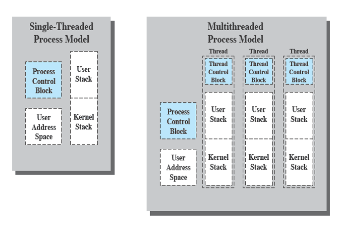

Introduction to Threads.
========================

Most operating systems contain two fundamental forms of concurrent
activity: processes and interrupts. Interrupts are handled concurrently
because of events generated by the hardware. You have already learned
about processes. Each process `owns` a virtual address space that holds
the data used by the process. The OS performs a protection function to
prevent unwanted interference between processes with respect to
resources. Any sharing of data between two processes must occur due to
external mechanism such as files, sockets, or other interprocess
communication. This is primarily due to the restriction imposed by the
OS that one process cannot read or write contents from the virtual
address space of another process.




However, what if two processes have a shared address space, so that the
data is available to both of them and the changes made by one process
can be seen by the other. This is precisely the motivation between
threads. Two threads share everything in the address space except their
stack. Figure above illustrates the distinction between threads and
processes from the point of view of process management. In a
single-threaded process model (i.e., there is no distinct concept of
thread), the representation of a process includes its process control
block and user address space, as well as user and kernel stacks to
manage the call/return behavior of the execution of the process. While
the process is running, it controls the processor registers. The
contents of these registers are saved when the process is not running.
In a multithreaded environment, there is still a single process control
block and user address space associated with the process, but now there
are separate stacks for each thread, as well as a separate control block
for each thread containing register values, priority, and other
thread-related state information.

Thread Examples
===============

Please look at the code available here
https://github.com/CS3281-2016/examples/tree/master/threads/introduction

Question:
=========

Why concurrent execution with threads is more efficient than processes?

Threads - lifecycle
===================

Every process when launched has one thread by default at the beginning.
Therefore, sometime we also call them "single-threaded" processes. To
find out how many threads a given process has you can use the following
command.

```bash
    vagrant@Xubuntu-Vagrant:~/examples/bin$ cat /proc/1/status |grep Threads
    Threads:    1
```

Here `1` is the PID of the process you are trying to find the number of
threads for. By default all processes will have 1 thread. I encourage
you to validate it yourself. At any time, a new thread can be created
from the code. The lifecycle of a thread is very similar to the
lifecycle of a process

-   It is created

-   It executes

-   It terminates.

How does scheduler view the threads
-----------------------------------

When you create a new thread it gets a new identifier in the kernel.
This identifier is called the thread id. The PID of the thread is the
process id of the main process that was the first thread in the process.
For example, here is an output from the execution of
[https://github.com/CS3281-2016/examples/blob/master/threads/introduction/main-thread-0.c](https://github.com/cs3281/examples/blob/main/threads/introduction/main-thread-0.c)

``` bash
    vagrant@Xubuntu-Vagrant:~/examples/build$ ../bin/main-thread-0 2
    vagrant@Xubuntu-Vagrant:~/examples/build$ ../bin/main-thread-0 2
    From the main process thread: getpid: 15098 getpthread_self: 140539903571712 tid:15098
    From main thread, created threads, A:140539895240448 and B:140539886847744
    main: begin [balance = 0] [6020ac]
    A: begin [addr of i: 0x7fd1fe884f2c]
    A: done
    From the thread getpid: 15098 getpthread_self: 140539895240448 tid:15099
    B: begin [addr of i: 0x7fd1fe083f2c]
    B: done
    From the thread getpid: 15098 getpthread_self: 140539886847744 tid:15100
    main: done
     [balance: 4]
     [should: 4]
```

Take a look at the PID and TID value for the two new threads that were
created by the code in main function (refer back to the code in
[main-thread-0.c](https://github.com/cs3281/examples/blob/main/threads/introduction/main-thread-0.c)).
The values are

| Thread | PID | TID |
| ------------- |:-------------:| -----:|
| main | 15098 | 15098 |
| A | 15098 | 15099 |
| B | 15098 | 15100 |

Notice the pattern. A quick way to determine if the current thread of
execution is the main thread i.e. the first thread that was created at
the start of the process is to check the following condition

```C
    if(getpid()==syscall(SYS_gettid)
```

So from the scheduler's perspective all processes are viewed as threads
- since they have a thread id and managed as individual and separate
tasks. So from a scheduler's perspective two processes with one thread
each and one process with two threads are similar. Both lead to two
threads with separate TIDs that have to be individually scheduled.

**Note** that if you have a single core machine, only one thread will
ever execute. The kernel will have to context switch (as we discussed
earlier during the process lectures).

**Question** - so can you think back again if there is no difference in
how the scheduler handles the

-   2 processes with one thread each

-   and 1 process with two threads

Then why is it more efficient to use multithreading? Hint: The answer
relates to paging and TLB and spatial locality.

Memory sections for the new thread.
===================================

Each Thread has its own stack? Can you guess why? However, threads in
the same process share the same heap. The steps involved in creating a
new thread are as follows.

```C
    void f1()
    {
    //do some work in the new thread
    }
    int main()
    {

    // Do some work

    // create a thread - Launch function f1 in the thread. The thread will terminate when function f1 finishes.

    // Finish work

    }
```

-   Let us suppose the program that you launched as a process from the
    shell is called the main process: P1. This process will have a PID,
    say 1000. The PID 1000 will have its stack and heap - just as we
    have discussed till now.

-   As shown above at some point the thread is created. This is done in
    a way similar to how fork is implemented. The only difference is
    that a new flag called CLONE\_VM (see
    http://www.makelinux.net/books/lkd2/ch03lev1sec3 for reference)
    is passed. This flag tells the kernel to not create a new
    address space. Note that internally a new process is created but the
    old one and the new one share the address space.

-   At this point, if you issue get PID call in the main process (the
    original thread) and the newly created thread, the answer will be
    the same. However, the thread id will be different as we
    saw earlier.

-   So the question is when and where the stack of the newly created
    thread is set up. The answer is that before the thread library
    issues the system call to create the thread, it mallocs a memory
    area from the heap and use that to set up the stack size of the
    newly created thread.

Thread APIs
===========

Here is a list of some important thread API (only related to thread
creation and execution) and their function. There are other mutual
exclusion related APIs. But we will discuss them later.

-   [pthread\_attr\_init()](https://computing.llnl.gov/tutorials/pthreads/man/pthread_attr_init.txt)--Initialize
    a Thread Attributes Object

-   [pthread\_create()](https://computing.llnl.gov/tutorials/pthreads/man/pthread_create.txt)--Create
    a Thread

-   [pthread\_self()](https://computing.llnl.gov/tutorials/pthreads/man/pthread_self.txt)--Get
    Pthread Handle

-   [pthread\_cancel()](https://computing.llnl.gov/tutorials/pthreads/man/pthread_cancel.txt)--Cancel
    a Thread

-   [pthread\_kill()](https://computing.llnl.gov/tutorials/pthreads/man/pthread_kill.txt)--Send
    a Signal to a Thread

-   [pthread\_exit()](https://computing.llnl.gov/tutorials/pthreads/man/pthread_exit.txt)--Terminate
    The Calling Thread (does not cause the whole program to terminate)

-   [pthread\_detach()](https://computing.llnl.gov/tutorials/pthreads/man/pthread_detach.txt)--Detach
    a Thread

-   [pthread\_join()](https://computing.llnl.gov/tutorials/pthreads/man/pthread_join.txt)--Wait
    for and Detach a Thread (similar to wait for processes.)

-   [pthread\_equal()](https://computing.llnl.gov/tutorials/pthreads/man/pthread_equal.txt)--Compare
    Two Threads

pthread\_create
---------------

Here is how to use it.

```C
    pthread_t p1, p2;
    pthread_create(&p1, NULL, mythread, "A"); 
    pthread_create(&p2, NULL, mythread, "B");
```

The p1, and p2 are opaque pthread structs. They can be also used as ids.
For example,

```C
    printf("From main thread, created threads, A:%lu and B:%lu\n",p1,p2);
```

So how does pthread create work?

Here is the code from uclibc of the pthread\_create API - the function
the creates a new thread

```C
    int
    __pthread_create_2_1 (
         pthread_t *newthread,
         const pthread_attr_t *attr,
         void *(*start_routine) (void *),
         void *arg)
    {
      STACK_VARIABLES;

      const struct pthread_attr *iattr = (struct pthread_attr *) attr;
      if (iattr == NULL)
        /* Is this the best idea?  On NUMA machines this could mean
           accessing far-away memory.  */
        iattr = &default_attr;

      struct pthread *pd = NULL;
      int err = ALLOCATE_STACK (iattr, &pd);  // a stack is allocated. This is done using malloc internally.
      if (__builtin_expect (err != 0, 0))
        /* Something went wrong.  Maybe a parameter of the attributes is
           invalid or we could not allocate memory.  */
        return err;


      /* Initialize the TCB.  All initializations with zero should be
         performed in 'get_cached_stack'.  This way we avoid doing this if
         the stack freshly allocated with 'mmap'.  */

    #ifdef TLS_TCB_AT_TP
      /* Reference to the TCB itself.  */
      pd->header.self = pd;

      /* Self-reference for TLS.  */
      pd->header.tcb = pd;
    #endif

      /* Store the address of the start routine and the parameter.  Since
         we do not start the function directly the stillborn thread will
         get the information from its thread descriptor.  */
      pd->start_routine = start_routine;
      pd->arg = arg;

      /* Copy the thread attribute flags.  */
      struct pthread *self = THREAD_SELF;
      pd->flags = ((iattr->flags & ~(ATTR_FLAG_SCHED_SET | ATTR_FLAG_POLICY_SET))
               | (self->flags & (ATTR_FLAG_SCHED_SET | ATTR_FLAG_POLICY_SET)));

      /* Initialize the field for the ID of the thread which is waiting
         for us.  This is a self-reference in case the thread is created
         detached.  */
      pd->joinid = iattr->flags & ATTR_FLAG_DETACHSTATE ? pd : NULL;

      /* The debug events are inherited from the parent.  */
      pd->eventbuf = self->eventbuf;


      /* Copy the parent's scheduling parameters.  The flags will say what
         is valid and what is not.  */
      pd->schedpolicy = self->schedpolicy;
      pd->schedparam = self->schedparam;

      /* Copy the stack guard canary.  */
    #ifdef THREAD_COPY_STACK_GUARD
      THREAD_COPY_STACK_GUARD (pd);
    #endif

      /* Copy the pointer guard value.  */
    #ifdef THREAD_COPY_POINTER_GUARD
      THREAD_COPY_POINTER_GUARD (pd);
    #endif

      /* Determine scheduling parameters for the thread.  */
      if (attr != NULL
          && __builtin_expect ((iattr->flags & ATTR_FLAG_NOTINHERITSCHED) != 0, 0)
          && (iattr->flags & (ATTR_FLAG_SCHED_SET | ATTR_FLAG_POLICY_SET)) != 0)
        {
          INTERNAL_SYSCALL_DECL (scerr);

          /* Use the scheduling parameters the user provided.  */
          if (iattr->flags & ATTR_FLAG_POLICY_SET)
        pd->schedpolicy = iattr->schedpolicy;
          else if ((pd->flags & ATTR_FLAG_POLICY_SET) == 0)
        {
          pd->schedpolicy = INTERNAL_SYSCALL (sched_getscheduler, scerr, 1, 0);
          pd->flags |= ATTR_FLAG_POLICY_SET;
        }

          if (iattr->flags & ATTR_FLAG_SCHED_SET)
        memcpy (&pd->schedparam, &iattr->schedparam,
            sizeof (struct sched_param));
          else if ((pd->flags & ATTR_FLAG_SCHED_SET) == 0)
        {
          INTERNAL_SYSCALL (sched_getparam, scerr, 2, 0, &pd->schedparam);
          pd->flags |= ATTR_FLAG_SCHED_SET;
        }

          /* Check for valid priorities.  */
          int minprio = INTERNAL_SYSCALL (sched_get_priority_min, scerr, 1,
                          iattr->schedpolicy);
          int maxprio = INTERNAL_SYSCALL (sched_get_priority_max, scerr, 1,
                          iattr->schedpolicy);
          if (pd->schedparam.sched_priority < minprio
          || pd->schedparam.sched_priority > maxprio)
        {
          err = EINVAL;
          goto errout;
        }
        }

      /* Pass the descriptor to the caller.  */
      *newthread = (pthread_t) pd;

      /* Remember whether the thread is detached or not.  In case of an
         error we have to free the stacks of non-detached stillborn
         threads.  */
      bool is_detached = IS_DETACHED (pd);

      /* Start the thread.  */
      err = create_thread (pd, iattr, STACK_VARIABLES_ARGS);
      if (err != 0)
        {
          /* Something went wrong.  Free the resources.  */
          if (!is_detached)
        {
        errout:
          __deallocate_stack (pd);
        }
          return err;
        }

      return 0;
    }
```

# Pthread Attributes

All threads when they are created are given some attributes. It is important to review the pthread attribute data structure. it is used to control the properties of the newly created thread. Look at [pthread_attr.c](https://github.com/cs3281/examples/blob/main/threads/pthread_attr_example/pthread_attr.c)

Before we can use the thread attribute, we must initialize it

```C
pthread_attr_t attr;
s = pthread_attr_init (&attr);
if (s != 0)
   handle_error_en (s, "pthread_attr_init"); // here the 
   //handle error is a function that prints the integer code -s and a message.
```

Thereafter you can set the following properties

## Thread Detached state

- Thread detached state specifies wether some other thread will want to know the when the thread being created terminates. 
- if a thread's state is not detached, it is called a PTHREAD_CREATE_JOINABLE thread. That means a thread can use the pthread join api to join this thread and know when it terminates
- When a thread is created detached (PTHREAD_CREATE_DETACHED), its thread ID and other resources can be reused as soon as the thread terminates. 
- The default is PTHREAD_CREATE_JOINABLE.
- You set this state as follows

```C
int s = pthread_attr_setdetachstate (&attr, PTHREAD_CREATE_DETACHED);
if (s != 0)
        handle_error_en (s, "pthread_attr_setdetachstate");
```

** Note** - pthread join call will fail if invoked on a detached thread. 

**Note** - it is possible to change the state of a thread from joinable to detach once it has been created. But if it was created as detached, you cannot make it joinable. Can you guess why? (Read http://pubs.opengroup.org/onlinepubs/009695399/functions/pthread_detach.html)

```C
int s = pthread_detach(t}; //where t is the pthread_t data structure for a thread. 
```

## Other important attribute parameters are set as follows

```C
   s = pthread_attr_setinheritsched (&attr, PTHREAD_EXPLICIT_SCHED); // inherit scheduling parameters
      if (s != 0)
        handle_error_en (s, "pthread_attr_setinheritsched");

      stack_size = strtoul (argv[1], NULL, 0);

      s = posix_memalign (&sp, sysconf (_SC_PAGESIZE), stack_size);
      if (s != 0)
        handle_error_en (s, "posix_memalign");

      printf ("posix_memalign() allocated at %p\n", sp); 

      s = pthread_attr_setstack (&attr, sp, stack_size); //set the stack size. 
      //Note that it has to be aligned to page size. This is done by memalign function as shown above.
      if (s != 0)
        handle_error_en (s, "pthread_attr_setstack");
    }
```

Here is the output of the pthread attr example (https://github.com/CS3281-2016/examples/blob/master/threads/pthread_attr_example/pthread_attr.c)

```
./pthread_attr 
Thread attributes:
	Detach state        = PTHREAD_CREATE_JOINABLE
	Scope               = PTHREAD_SCOPE_SYSTEM
	Inherit scheduler   = PTHREAD_INHERIT_SCHED
	Scheduling policy   = SCHED_OTHER
	Scheduling priority = 0
	Guard size          = 4096 bytes
	Stack address       = 0x7f12df2da000
	Stack size          = 0x801000 bytes
```

# Other  important concepts to know -- see examples in thread folder

- Thread termination
  - call pthread_exit
  - return from the thread entry function
  - thread can be canceled by invoking pthread_cancel
  
- The pthread_cancel() function shall request that thread be canceled. The action depends upon the 
   - The cancelability state of the thread
   -  the thread is in a library method that is a cancellation point.
   
   
# Thread cancelability state
```C
int pthread_setcancelstate(int state, int *oldstate); 
int pthread_setcanceltype(int type, int *oldtype);
```

- pthread_setcancelstate() sets the cancelability state of the calling thread to the value given in state. The previous cancelability state of the thread is returned in the buffer pointed to by oldstate. The state argument must have one of the following values: 
  - PTREAD_CANCEL_ENABLE The thread is cancelable. This is the default cancelability state in all new threads, including the initial thread. The thread's cancelability type determines when a cancelable thread will respond to a cancellation request.
  - PTHREAD_CANCEL_DISABLE The thread is not cancelable. If a cancellation request is received, it is blocked until cancelability is enabled.
  
-  pthread_setcanceltype(int type, int *oldtype). sets the cancelability type of the calling thread to the value given in type. The previous cancelability type of the thread is returned in the buffer pointed to by oldtype. The type argument must have one of the following values:
  - PTHREAD_CANCEL_DEFERRED A cancellation request is deferred until the thread next calls a function that is a cancellation point. This is the default cancelability type in all new threads, including the initial thread. 
  - PTHREAD_CANCEL_ASYNCHRONOUS The thread can be canceled at any time. (Typically, it will be canceled immediately upon receiving a cancellation request, but the system doesn't guarantee this.)


# Cancellation Points

POSIX.1 specifies that certain functions must, and certain other functions may, be cancellation points. If a thread is cancelable, its cancelability type is deferred, and a cancellation request is pending for the thread, then the thread is canceled when it calls a function that is a cancellation point.

- For example
  - sleep
  - close
  - These functions have been deemed safe to cancel a thread as it exits out of the function. Not all functions are async cancel safe.
  
# Note on thread exit status.

If you recall the thread entry function has a sinature

```C
void* thread_entry (void * arg);
```

That is, it returns a ```void *```. Typically threads might return null i.e. return 0. However, they might allocate a datastructure on heap and retun its address as return value. This value can be obtained by the pthread join api. 

Here is an example from https://computing.llnl.gov/tutorials/pthreads/samples/join.c

``` C
#include <pthread.h>
 #include <stdio.h>
 #include <stdlib.h>
 #include <math.h>
 #define NUM_THREADS	4

 void *BusyWork(void *t)
 {
    int i;
    long tid;
    double result=0.0;
    tid = (long)t;
    printf("Thread %ld starting...\n",tid);
    for (i=0; i<1000000; i++)
    {
       result = result + sin(i) * tan(i);
    }
    printf("Thread %ld done. Result = %e\n",tid, result);
    pthread_exit((void*) t);
 }

 int main (int argc, char *argv[])
 {
    pthread_t thread[NUM_THREADS];
    pthread_attr_t attr;
    int rc;
    long t;
    void *status;

    /* Initialize and set thread detached attribute */
    pthread_attr_init(&attr);
    pthread_attr_setdetachstate(&attr, PTHREAD_CREATE_JOINABLE);

    for(t=0; t<NUM_THREADS; t++) {
       printf("Main: creating thread %ld\n", t);
       rc = pthread_create(&thread[t], &attr, BusyWork, (void *)t);  
       if (rc) {
          printf("ERROR; return code from pthread_create() is %d\n", rc);
          exit(-1);
          }
       }

    /* Free attribute and wait for the other threads */
    pthread_attr_destroy(&attr);
    for(t=0; t<NUM_THREADS; t++) {
       rc = pthread_join(thread[t], &status);
       if (rc) {
          printf("ERROR; return code from pthread_join() is %d\n", rc);
          exit(-1);
          }
       printf("Main: completed join with thread %ld having a status   
             of %ld\n",t,(long)status);
       }
 
 printf("Main: program completed. Exiting.\n");
 pthread_exit(NULL);
 }
 ```

Reference/ Reading material
===========================

-   <https://computing.llnl.gov/tutorials/pthreads/>

-   Please try out the exercises described in the notes.
