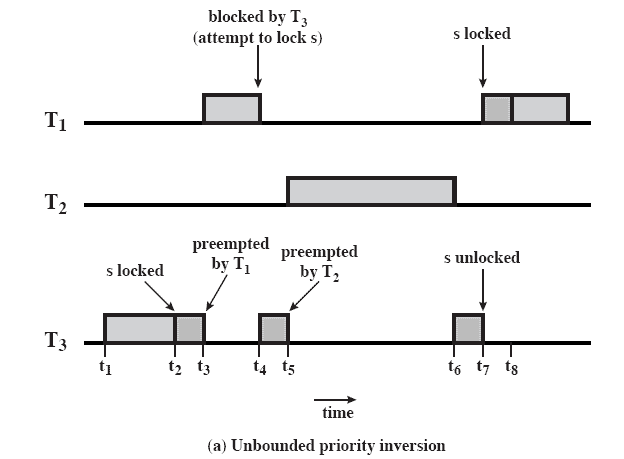
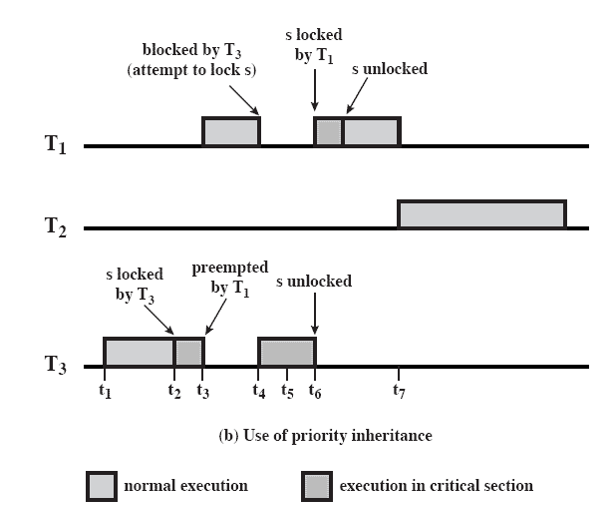

# Real-time scheduling policies

**Real-Time Tasks** - Tasks whose correctness depends not only on the logical result of the computation but also on the time at which the results are produced. Typically, these tasks attempt to control or react to physical events. For example, consider a task that computes the braking thrust and provides input to the pneumatic actuator for braking. Imaging what will happen if this computation does not finish in time. Real-time computing is becoming an increasingly important discipline. The operating system, and in particular the scheduler, is perhaps the most important component of a real-time system. 

**Periodic vs aperiodic tasks** - Another characteristic of real-time tasks is whether they are periodic or aperiodic.
An aperiodic task has a deadline by which it must finish or start, or it may have
a constraint on both start and finish time. In the case of a periodic task , the requirement
may be stated as “once per period T ” or “exactly T units apart.”.  For example, a sensor which takes the temperature measurement every minute is a periodic task. The braking task that is run whenever the brake is pressed is a sporadic task. 

**preemption** - In real-time scheduling we pay special attention to the concept of preemption. A scheduling policy is said to be preemptive if it allows the current task to be context switched to a different task, with possibly, a more urgent deadline. A number of scheduling policies as we discussed before are non-preemptive.

## Classes of real-time scheduling algorithms

- Static table-driven approaches: These perform a static analysis of feasible
schedules of dispatching. The result of the analysis is a schedule that determines,
at run time, when a task must begin execution. Static table-driven scheduling is applicable to tasks that are periodic. Input
to the analysis consists of the periodic arrival time, execution time, periodic ending
deadline, and relative priority of each task. The scheduler attempts to develop
a schedule that enables it to meet the requirements of all periodic tasks. This is
a predictable approach but one that is inflexible, because any change to any task
requirements requires that the schedule be redone. Earliest-deadline-first or other
periodic deadline techniques (discussed subsequently) are typical of this category of
scheduling algorithms.

- Static priority-driven preemptive approaches: Again, a static analysis is performed,
but no schedule is drawn up. Rather, the analysis is used to assign
priorities to tasks, so that a traditional priority-driven preemptive scheduler
can be used. Static priority-driven preemptive scheduling makes use of the priority-driven
preemptive scheduling mechanism common to most non-real-time multiprogramming
systems. In a non-real-time system, a variety of factors might be used to
determine priority. For example, in a time-sharing system, the priority of a process
changes depending on whether it is processor bound or I/O bound. In a real-time
system, priority assignment is related to the time constraints associated with each
task. One example of this approach is the rate monotonic algorithm (discussed
subsequently), which assigns static priorities to tasks based on the length of their
periods.

- Dynamic planning-based approaches: Feasibility is determined at run time
(dynamically) rather than offline prior to the start of execution (statically).
An arriving task is accepted for execution only if it is feasible to meet its time
constraints. One of the results of the feasibility analysis is a schedule or plan
that is used to decide when to dispatch this task. With dynamic planning-based scheduling , after a task arrives, but before its
execution begins, an attempt is made to create a schedule that contains the previously
scheduled tasks as well as the new arrival. If the new arrival can be scheduled
in such a way that its deadlines are satisfied and that no currently scheduled task
misses a deadline, then the schedule is revised to accommodate the new task.

- Dynamic best effort approaches: No feasibility analysis is performed. The system
tries to meet all deadlines and aborts any started process whose deadline
is missed. Dynamic best effort scheduling is the approach used by many real-time systems
that are currently commercially available. When a task arrives, the system
assigns a priority based on the characteristics of the task. Some form of deadline
scheduling, such as earliest-deadline scheduling, is typically used. Typically, the
tasks are aperiodic and so no static scheduling analysis is possible. With this type
of scheduling, until a deadline arrives or until the task completes, we do not know
whether a timing constraint will be met. This is the major disadvantage of this form
of scheduling. Its advantage is that it is easy to implement.

## Example Real-time Scheduling Policies

### Earliest Deadline First

Most contemporary real-time operating systems are designed with the objective of
starting real-time tasks as rapidly as possible, and hence emphasize rapid interrupt
handling and task dispatching. In fact, this is not a particularly useful metric in evaluating
real-time operating systems. Real-time applications are generally not concerned
with sheer speed but rather with completing (or starting) tasks at the most
valuable times, neither too early nor too late, despite dynamic resource demands
and conflicts, processing overloads, and hardware or software faults. It follows that
**priorities** provide a crude tool and do not capture the requirement of completion
(or initiation) at the most valuable time.

The earliest deadline scheduling policy makes a decision and pick tasks with earliest deadline at each preemption point. These points can be 
 - preprogrammed timer interrupts
 - invocation of a system call.
 - When a new task is launched
 - when the current task finishes

**Note** - Earliest deadline first is the optimal real-time scheduling policy. That is with this policy we can potentially reach 100% CPU utilization.

EDF Scheduling Critierion: Sum(Execution Time/Period) of all tasks <=1

### Rate Monotonic Scheduling

Recall that in EDF, we have to continuously search across all available tasks to find the task with earliest deadline. In a system with thousands of tasks this overhead is not minimal. The rate monotonic algorithm has been designed to mix the deadline based scheduling with the simiplicity of priority based decision making.

The key idea in the RMS algorithm is that the task with a high periodicity should be given a higer priority. 

Given N tasks, in RMS we arrange them in periodicity (increasing frequency) order  and provide higher priority to tasks that are more frequent. Then, at runtime the scheduling decision is made using the priority of ready tasks. RMS will preempt a task if a task with higer priority becomes ready.

**Note** :RMS Scheduling Critierion: Sum(Execution Time/Period) of all tasks <= natural logarithm of 2. The actual formula is in the slides.

## Problem of priority inversion

Priority inversion is a phenomenon that can occur in any priority-based preemptive
scheduling scheme but is particularly relevant in the context of real-time scheduling.
The best-known instance of priority inversion involved the Mars Pathfinder
mission. This rover robot landed on Mars on July 4, 1997 and began gathering and
transmitting voluminous data back to Earth. But a few days into the mission, the
lander software began experiencing total system resets, each resulting in losses of
data. After much effort by the Jet Propulsion Laboratory (JPL) team that built the
Pathfinder, the problem was traced to priority inversion.

In any priority scheduling scheme, the system should always be executing the
task with the highest priority. Priority inversion occurs when circumstances within
the system force a higher-priority task to wait for a lower-priority task. A simple
example of priority inversion occurs if a lower-priority task has locked a resource
(such as a device or a binary semaphore) and a higher-priority task attempts to lock
that same resource. The higher-priority task will be put in a blocked state until the
resource is available. If the lower-priority task soon finishes with the resource and
releases it, the higher-priority task may quickly resume and it is possible that no
real-time constraints are violated.

### Example

The basic idea of priority inheritance is that a lower-priority task inherits
the priority of any higher-priority task pending on a resource they share. This
priority change takes place as soon as the higher-priority task blocks on the
resource; it should end when the resource is released by the lower-priority task.

For example, The Pathfinder software included the following three tasks, in decreasing
order of priority:
- T1 : Periodically checks the health of the spacecraft systems and software
- T2 : Processes image data
- T3 : Performs an occasional test on equipment status

After T1 executes, it reinitializes a timer to its maximum value. If this timer
ever expires, it is assumed that the integrity of the lander software has somehow
been compromised. The processor is halted, all devices are reset, the software is
completely reloaded, the spacecraft systems are tested, and the system starts over.
This recovery sequence does not complete until the next day. T1 and T3 share a
common data structure, protected by a binary semaphore s. Figure shows the
sequence that caused the priority inversion:

 - t1 : T3 begins executing.
- t2 : T3 locks semaphore s and enters its critical section.
- t3 : T1 , which has a higher priority than T3 , preempts T3 and begins executing.
- t4 : T1 attempts to enter its critical section but is blocked because the semaphore
is locked by T 3 ; T 3 resumes execution in its critical section.
- t5 : T 2 , which has a higher priority than T3 , preempts T3 and begins executing.
- t6 : T2 is suspended for some reason unrelated to T1 and T3 ; T3 resumes.
- t7 : T3 leaves its critical section and unlocks the semaphore. T1 preempts T3 ,
locks the semaphore and enters its critical section.

In this set of circumstances, T1 must wait for both T3 and T2 to complete and fails to
reset the timer before it expires.

In practical systems, two alternative approaches are used to avoid unbounded
priority inversion: priority inheritance protocol and priority ceiling protocol.

### Priority Inheritance

Figure shows that priority inheritance resolves the problem of unbounded
priority inversion illustrated the figure on previous slide. The relevant sequence of events is
as follows:

- t1 : T3 begins executing.
- t2 : T3 locks semaphore s and enters its critical section.
- t3 : T1 , which has a higher priority than T 3 , preempts T 3 and begins executing.
- t4 : T1 attempts to enter its critical section but is blocked because the semaphore
is locked by T3 . T3 is immediately and temporarily assigned the same
priority as T1 . T3 resumes execution in its critical section.
- t5 : T2 is ready to execute but, because T3 now has a higher priority, T2 is unable
to preempt T3 .
- t6 : T3 leaves its critical section and unlocks the semaphore: its priority level is
downgraded to its previous default level. T1 preempts T3 , locks the semaphore,
and enters its critical section.
- t7 : T1 is suspended for some reason unrelated to T2 , and T2 begins executing.

This was the approach taken to solving the Pathfinder problem.

