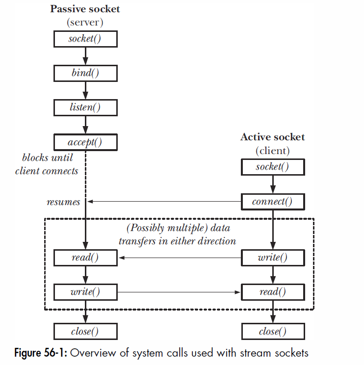

***Sockets***

Sockets are a method of IPC that allow data to be exchanged between
applications, either on the same host (computer) or on different hosts
connected by a network. First in BSD in 1983.

In a typical client-server scenario, applications communicate using
sockets as follows:

-   Each application creates a socket. A socket is the “apparatus” that
    allows communication,

and both applications require one.

-   The server binds its socket to a well-known address (name) so that
    clients can

locate it.

A socket is created using the socket() system call, which returns a file
descriptor used to refer to the socket in subsequent system calls:

fd = socket(domain, type, protocol);

We describe socket domains and types in the following paragraphs. For
all applications described in this book, protocol is always specified as
0.

Sockets exist in a communication domain:

-   Tells you how to identify. Unix domain same host. IPv4, IPv6 –
    communication between applications running on hosts connected via an
    IPv4,v6 network

***Stream vs Datagram***

Stream is reliable, bidirectional, byte-stream. No concept of message
boundary.

Datagram: data is exchanged in the form of messages called datagrams.
You have boundaries, but transmission not reliable. Also called a
“connectionless” socket. Doesn’t need to be connected to another socket
to be used.

***Socket system calls***

1.  socket() creates a new socket. Returns a file descriptor that you
    use in other calls.

2.  bind() binds a socket to an address. Server binds to well known
    address so client can locate.

3.  Listen() allows a stream socket to accept incoming connections from
    other sockets.

4.  Accept() accepts a connection from a peer application on a listening
    stream socket.

5.  Connect() establishes a connection with another socket.

```C
int bind(int sockfd, const struct sockaddr addr, socklen_t addrlen);
```
Returns 0 on success, or –1 on error

```C
struct sockaddr {
sa_family_t sa_family; \* Address family (AF_constant) */
char sa_data[14]; \* Socket address (size varies according to socket domain) */
};
```

***Stream sockets***

Stream Sockets

The operation of stream sockets can be explained by analogy with the
telephone system:

- The socket() system call, which creates a socket, is the equivalent
of installing a telephone. In order for two applications to communicate, each of them
must create a socket.
- Communication via a stream socket is analogous to a telephone call. One application must connect its socket to another application’s socket before communication can take place. Two sockets are connected as follows:
a\) One application calls bind() in order to bind the socket to a
well-known address, and then calls listen() to notify the kernel of its willingness
to accept incoming connections. This step is analogous to having a known telephone number and ensuring that our telephone is turned on so that people can call us. b\) The other application establishes the connection by calling
connect(), specifying the address of the socket to which the connection is to be made. This is analogous to dialing someone’s telephone number. c\) The application that called listen() then accepts the connection
using accept(). This is analogous to picking up the telephone when it rings. If the
accept() is performed before the peer application calls connect(), then the accept()
blocks (“waiting by the telephone”).
- Once a connection has been established, data can be transmitted in both directions between the applications (analogous to a two-way telephone conversation) until one of them closes the connection using close(). Communication is performed using the conventional read() and write() system calls or via a number of socket specific system calls (such as send() and recv()) that provide additional functionality.

{}
