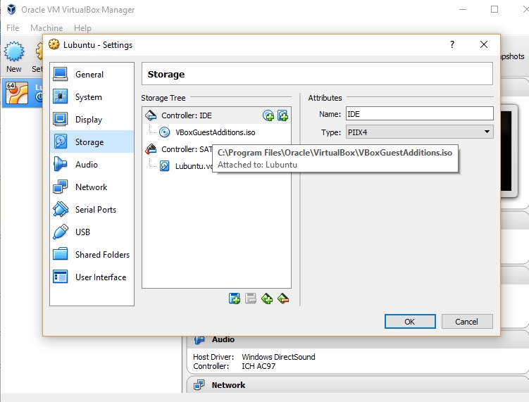

# VM setup instructions

We will be using a Linux virtual machine (VM) throughout this course. Below we give instructions on setting up this VM using VirtualBox and Ubuntu; you can use these instructions if you're running an x86 machine. You're welcome to use other virtualization software (such as VMWare Fusion, Parallels, or QEMU), as well as bare metal, and other distros if you're experienced with those. However, the instructor team cannot support those versions.

If you're on a Mac with Apple silicon and you want to use UTM, please follow the setup guide here: [https://mac.getutm.app/gallery/ubuntu-20-04](https://mac.getutm.app/gallery/ubuntu-20-04).
Non-free options for Apple silicon Macs include Parallels and VMWare Fusion.

# Step 1

Note: if you already have a newer version of Ubuntu installed, such as 22.04, you're free to use that.

- Download VirtualBox [here](https://www.virtualbox.org/wiki/Downloads).
- Download Ubuntu [here](https://ubuntu.com/download/desktop). Select the Desktop version.

# Step 2 

- Install VirtualBox (the default options should be fine). However, you might want to assign more memory and cores to the virtual machine to make it responsive. 

# Step 3

Setup the VM in VirtualBox.

- Open VirtualBox.
- Click "New". 
- For Name enter "Ubuntu" (or something else if you prefer), for Type select "Linux" and for Version select "Ubuntu (64-bit)". Press continue.
- The amount of memory you choose will depend on how much memory your computer has. Selecting half of what your computer has should be safe (you can always change this later).
- Select "Create a virtual hard disk now". You can select VDI (VirtualBox Disk Image) for the type. Select dynamically allocated. Specify 100 GB for the size. Don't worry, this doesn't automatically allocate this much space on your physical hard drive. It is better, however, to allocate this much early on as (unlike CPU and memory), this is a bit harder to change later.

You should now see your new VM as a selection on the left. Now it's time to install the OS.

# Step 4

Install the OS.

- Select the VM you created above (it should say "Powered Off").
- Press the green "Start" button.
- You'll be prompted for the disk file to start the virtual machine from. Select the Lubuntu image you downloaded in Step 1 (the filename should be something like "ubuntu-20.04-desktop-amd64.iso"). Click start.
- Select "English". 
- Select "Install Ubuntu".
- Your installation may appear to freeze. This is a known issue (see this [post](https://askubuntu.com/questions/948458/trouble-installing-lubuntu-desktop-17-04-on-vm-virtualbox)). You can make things right on a Mac by simultaneously holding down the "fn", "control", "option" and "F7" keys, and then simultaneously holding down the "fn", "control", "option" and "F1" keys. On a non-Mac, you should be able to hold down the right Ctrl + F7, followed by the right Ctrl + F1.
- You should now see the Welcome screen. Press Continue.
- Select both the "download updates" and "install third-party software" options. Click continue.
- Select "Erase disk and install ubuntu". Don't select any of the other options.
- You'll see a warning that you can safely ignore. Click continue.
- Select Chicago as the time zone. 
- Select the default keyboard layout.
- Choose a name you like for your computer's name and username. Don't encrypt the home folder. Click continue.
- The install process will proceed. How long this takes depends on your computer.
- Click restart now.

# Step 5

Install software packages. Most Linux distributions have a package management system that makes installing software simple. We'll need to install, at a minimum:

- make
- gcc
- g++
- git
- cmake


To do this:

- Open a terminal (Start menu > System tools > LXTerminal). Adding a link to the desktop is a good idea, too.
- Type the following commands (omit the "$"):

```bash
$ sudo apt-get update
$ sudo apt-get upgrade -y
$ sudo apt-get install git make gcc g++ cmake -y
```

# Step 6 (Better Screen Resolution and Shared Clipboard)

1. In guest virtual machine install dkms and x11 by typing in the following:

```$sudo apt-get install virtualbox-guest-utils virtualbox-guest-dkms -y```

2. Turn off the guest virtual machine. Add guestadditions.iso in VirtualBox by mounting it onto the virtual machine.


 
3. Reboot virtual machine and follow the instructions in this video [here](https://youtu.be/fbMDZJsMZg8?t=3m9s).

Essentially, when you boot you will see that a disk image is now on the desktop. Open terminal and cd into its location. Then type:
```$sudo sh VBoxLinuxAdditions.run ```
 
4. Now in your VM window on host, go to Device->shared clipboard. Enable it as bidirectional. Next, click the lubuntu start logo on your desktop. Click Preferences->Monitor/Display Settings. Choose the display resolution that would fit best with your actual computer resolution.

5. Reboot.

# Step 7
Set up SSH access to GitHub by following the instructions provided [here](https://help.github.com/articles/generating-a-new-ssh-key-and-adding-it-to-the-ssh-agent/). In particular, you'll need to add the new key to your GitHub account (instructions [here](https://help.github.com/articles/adding-a-new-ssh-key-to-your-github-account/)).

